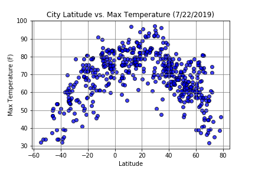
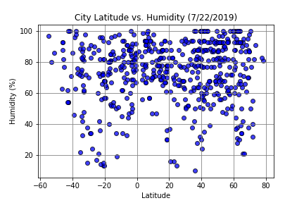
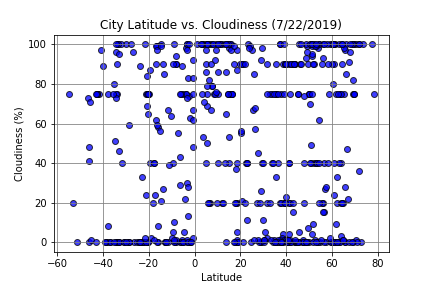
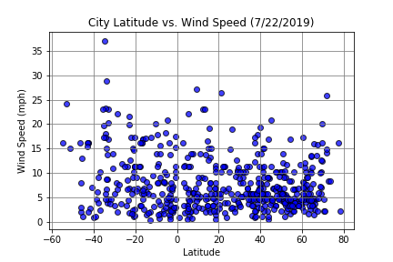

# HW6_WeatherPy

## Background
For this assignment we visualized weather for over 500 cities across the world using OpenWeatherMap APIto find relationships between temperature, latitude, humidity, cloudiness, and wind speed. 

### Latitude vs. Temperature 

* As you get closer to the equator, the temperature rises. 

### Latitude vs. Humidity

* Can't really see a relationship, it just seems very humid a lot in most cities.

### Latitude vs. Cloudiness

* Not a clear relationship between latitutde and cloudiness 

### Latitude vs. Wind Speed
 

* Not a clear relationship, seems like wind speeds stay relatively low depending on Latitude. 

Latitude and Temperature is the only scatter plot that shows a definitive relationship, but it would be nice to see how temperature and the other variables to see what the relationship is for them.
